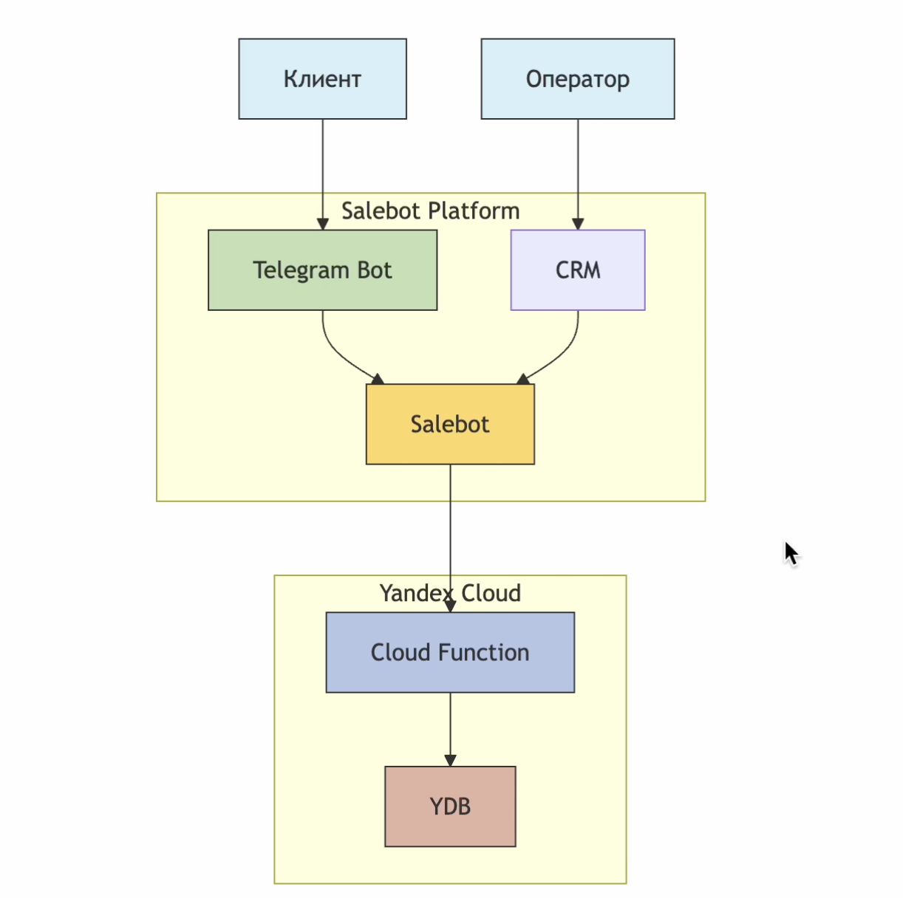
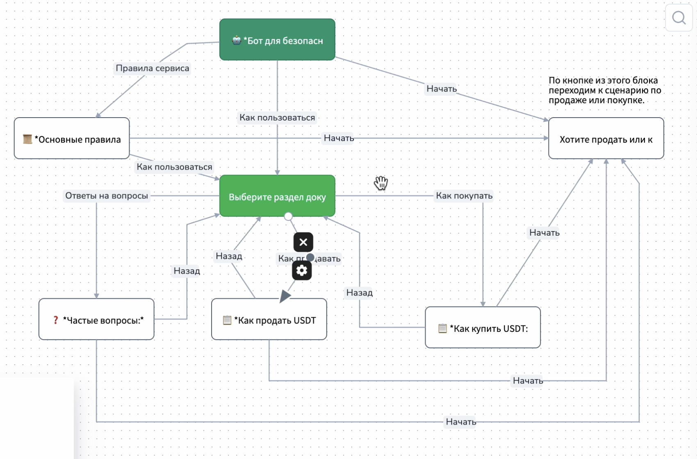
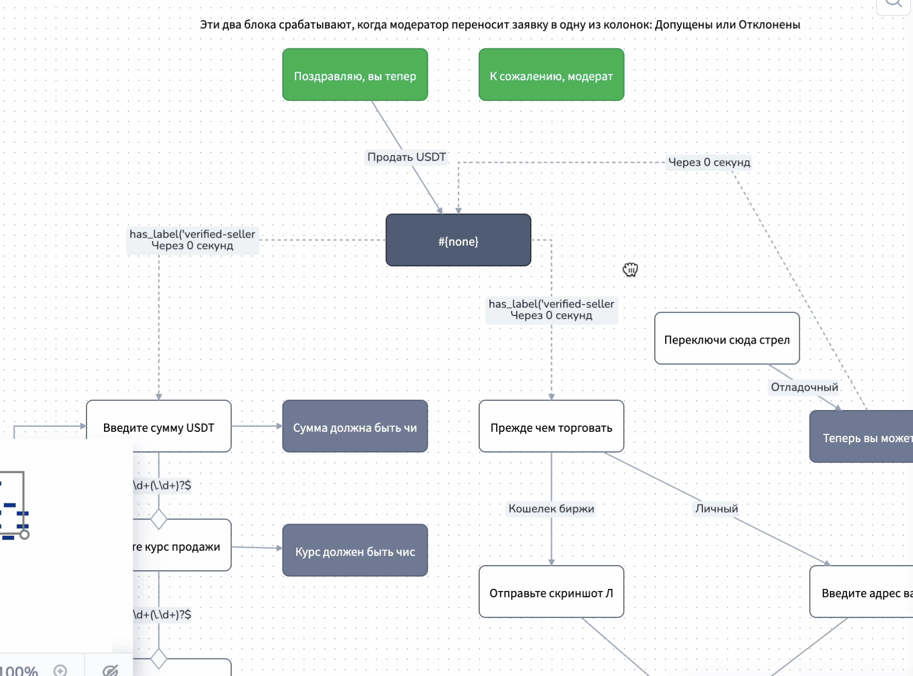
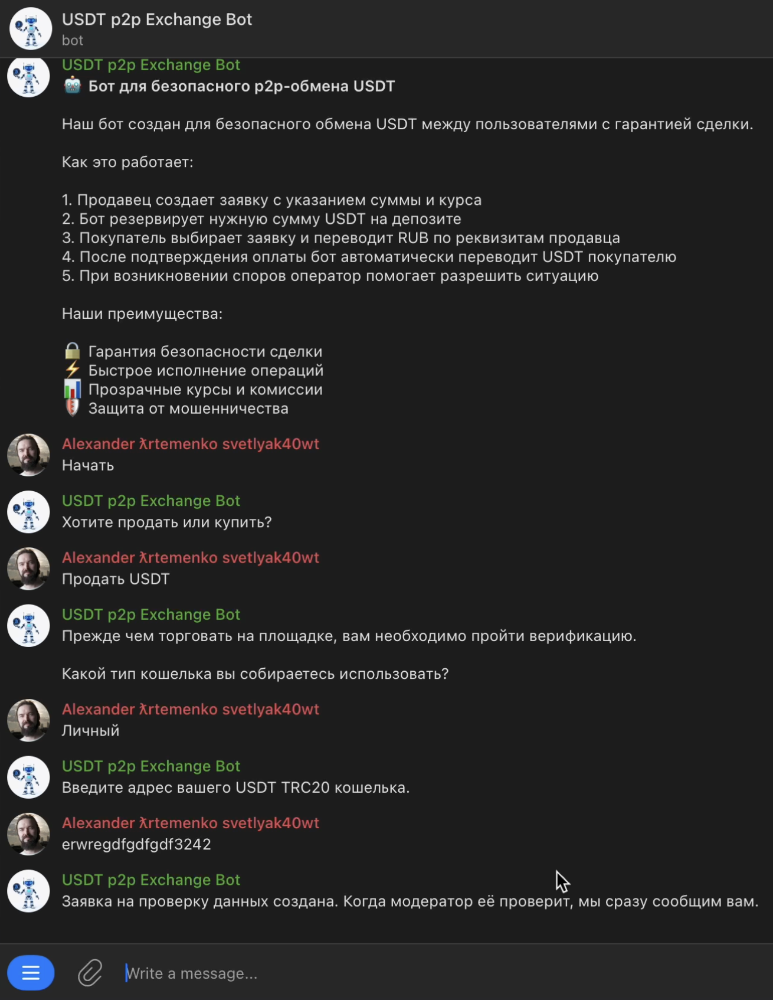
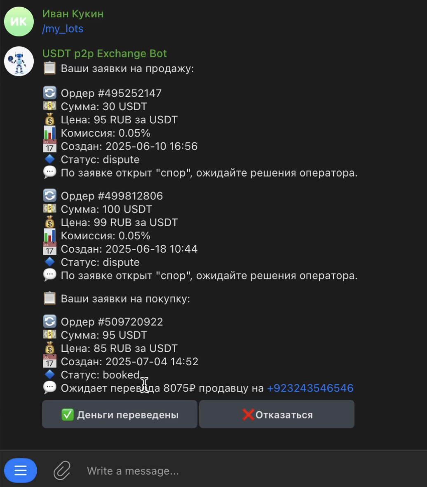
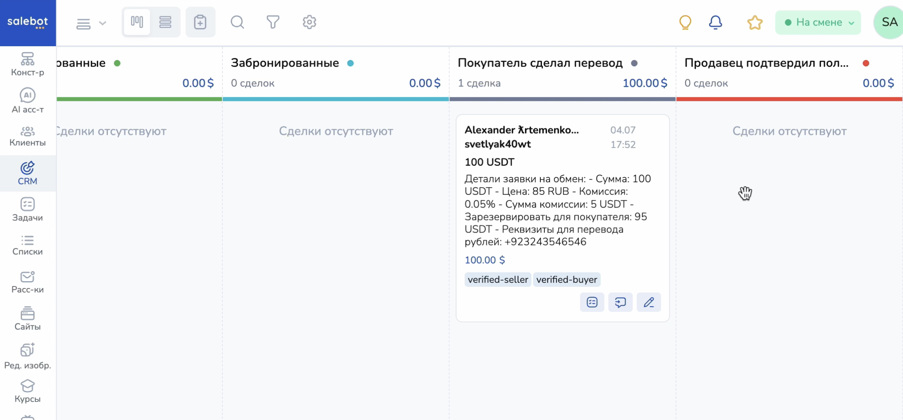

# Telegram-бот для P2P-обмена USDT

## **Цель проекта**  
Реализовать Telegram-бот для P2P-обмена USDT с ручным управлением оператора, комиссией для продавца, ограничениями по количеству операций и процедурами верификации пользователей.

---

## **Сценарии использования**

### 1. Создание заявки на продажу USDT  
**Роль**: Продавец  
**Действия**:  
1. Продавец создает заявку, указывая сумму USDT, курс и реквизиты.  
2. Система рассчитывает комиссию (например, 1%) и резервируемую сумму.  
3. Продавец подтверждает заявку, переводит USDT на адрес обменника и подтверждает перевод.  
4. Заявка переходит в статус "Ожидает оплаты".  

---

### 2. Поиск и бронирование заявки  
**Роль**: Покупатель  
**Действия**:  
1. Покупатель просматривает доступные заявки, отсортированные по курсу.  
2. Выбирает заявку, бронирует ее и получает реквизиты продавца.  
3. Переводит рубли на указанные реквизиты и подтверждает оплату.  

---

### 3. Подтверждение сделки  
**Роль**: Продавец  
**Действия**:  
1. Продавец проверяет поступление рублей и подтверждает получение.  
2. Заявка переходит в статус "Готова к исполнению".  

---

### 4. Отправка USDT покупателю  
**Роль**: Оператор  
**Действия**:  
1. Оператор вручную переводит USDT (за вычетом комиссии) на кошелек покупателя.  
2. Заявка помечается как "Исполнена", оба участника получают уведомление.  

---

### 5. Верификация пользователей  
- **Продавец**: подтверждает криптокошелек (адрес или скриншот биржи).  
- **Покупатель**: предоставляет фото банковской карты (с скрытым CVV/номером).  

---

### 6. Дополнительные сценарии  
- **Отмена заявки**: Продавец может отменить заявку до внесения депозита.  
- **Спор**: Участники могут инициировать спор для вмешательства оператора.  
- **Автоотмена**: Неоплаченные брони автоматически отменяются через N часов.  

---

## **Визуализация процессов**

### Архитектура системы

### Схема приветствия и документации

### Схема работы продавца

### Интерфейс продавца

### Интерфейс покупателя

### CRM оператора

